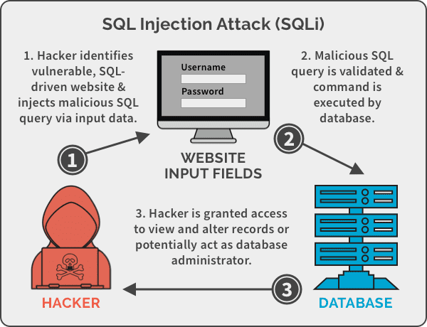
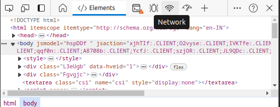
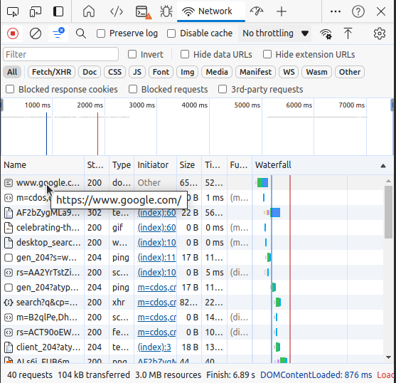
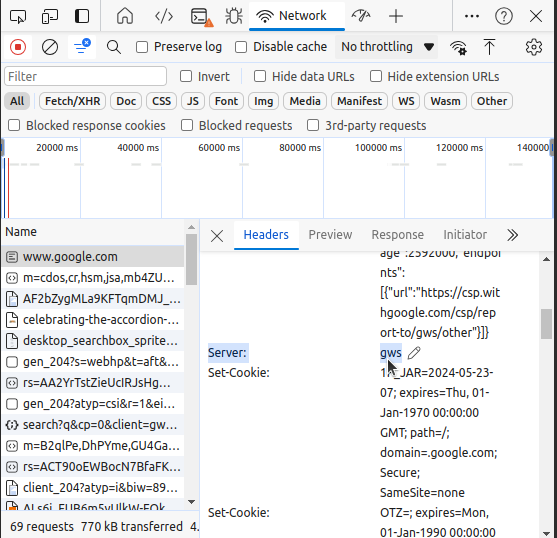
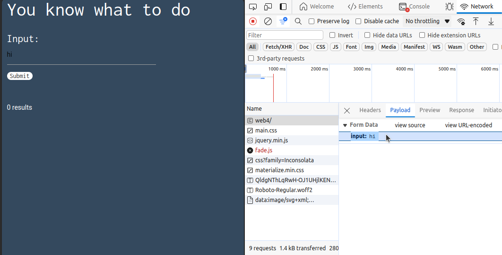

# SQL Injections (aka SQLi)

## What is SQLi?

SQL Injection (SQLi) is a security vulnerability that allows attackers to inject malicious SQL code into queries sent to a database. This can lead to unauthorized access to data, data manipulation, or even full control over the database. SQL is a standard language for managing data held in relational database management systems (RDBMS), including MySQL, Oracle, SQL Server, and others.

## Index
1. Basis to tackle SQLi (Below)
2. [Authentication By-Pass](./authentication_bypass.md)
3. [Union Based Attacks](./union_based_attacks.md)
4. [Blind Injections](./blind_injection.md)
5. [Time-Based Blind Injections](./time_based_blind_injections.md)
6. [Error Based Injections](./error_based_injections.md)
7. [Second Order Injections](./second_order_injections.md) 
  

## Basis to Tackle SQLi Challenges
- The `--` comments out the rest of the query, effectively bypassing the password check and logging the attacker in as any user.
- Basic SQL syntax
  1. `SELECT`
  Extracts data from the given table.

  1. `ORDER BY`
  Orders the results gotten from SELECT in a specific manner. For
  example, if one has a table of countries and their populations. One can
  select the countries starting with the letter R and then order them by
  their population.

  1. `UNION` clause allows you to group multiple queries together.

  2. `JOIN`
  Joins data from two tables depending on a certain characteristic on the
  table. So if a theres two table one with customer IDs and their addresses
  and another table with customer IDs and their purchases. You can join
  both tables so that the customer addresses match their purchases.
  1. `DELETE, INSERT`
  Allows you to delete data or add new data to a table.
  1. `AND,OR`
  Allows you to modify queries so that they return information depending
  on multiple categories.
  1. `MIN,MAX`
  They return the smallest or largest value of a query
- Look for places from where data might be used to construct a query. Like a textbox, or the url of the website.
- If Statements
This is one of the key techniques for Blind SQL Injection. Also very useful to test simpler things blindly yet accurately. It changes based on the database used as well.

  - MySQL If Statement
  
    >IF(condition,true-part,false-part) \
    SELECT IF(1=1,'true','false')

    SQL Server If Statement 

    >IF condition true-part ELSE false-part \
    IF (1=1) SELECT 'true' ELSE SELECT 'false'
  - Oracle If Statement
  
    
    >IF condition THEN true-part; ELSE false-part; 
    END IF; 
     \
    IF (1=1) THEN dbms_lock.sleep(3); ELSE dbms_lock.sleep(0); 
    END IF;  
    
  - PostgreSQL If Statement
    >SELECT 
    CASE WHEN condition THEN true-part ELSE false-part END; \
    SELECT CASE WHEN (1=1) THEN 'A' ELSE 'B' END;
  - SQLite If Statement
    >if(condition, true-part, false-part) \
    SELECT iif(1<2, "True", "False");
- DevTools is a great all-in one tool for starting with WEB-based CTF questions. Instead of having to learn so many specific softwares in the start, you can begin with using DevTools for the questions. As in case you need to check which type of server the website is running press `F12` or `Ctrl+Shift+I` and then go to the networks tab. 

  

  There click on the file having the same name as the website and scroll down the headers tab.

  

  Here you can find the type of server (Example Python, NodeJs ... etc) which can be useful in some problem when you need to perform Server-Specific Injections.

  

  In this example, it is running on a proprietary web server software made and used by Google.
- In the same tab above, you can also find many other useful things such as cookies (Keep an out for them, many times you can find hidden data and clues there) and the request sent by the browser. 

  

