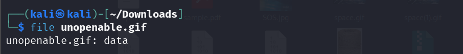

# Steganography

### Steghide

&#x20;At times when Steganography is used we may use Steghide to conceal data but the command can be modified to be able to crack the data concealed.&#x20;

&#x20;                        Syntax:    steghide extract -sf FILE

&#x20;                        Installation: sudo apt-get install steghide

&#x20;                        Embed data: steghide embed -cf cover\_image.jpg -ef hidden\_file.txt

### Stegsolve

&#x20;For an image, finding metadata can be difficult. Data concealed can be retrieved by using the stegsolve command.  This Steganographic tool helps us to analyze the color and bit plane of the image, manipulate pixels, identify discrepancies, image overlay&#x20;

&#x20;                         Syntax:  java -jar filename.jar

&#x20;                          Download the Stegsolve JAR file.

### Zsteg

Another such tool is Zsteg. It is powerful in analyzing png and bmp files

&#x20;                           Syntax:   zsteg \[OPTIONS] FILE(S)

&#x20;                           Installation:   gem install zsteg

&#x20;                           Options:         -a, --all (Perform all possible tests)

&#x20;                                                     \-q, --quiet (Suppress output, display only result)

&#x20;                                                     \-o, --offset (Start reading at a specific offset)

&#x20;                                                     \-E, --extract (Extract data using specific format, can be b1, b2 for LSB  &#x20;

&#x20;                                                                               and  second LSB)

&#x20;                                                     \-c, --compare (Compare with another file to highlight differences)

&#x20;                                                     \-F, --filter (Apply filter to data before analysis)

&#x20;                                                     \-L, --list (List available steg detection methods)

&#x20;                                                     \-m, --method (Use a specific method)

&#x20;                                                     \-t, --type (Specify the type of data to Analyze)

&#x20;                                                     \--hex (Display output in hexadecimal format)

#### WALKTHROUGH 2

Now that we have completed steganography. Lets see a medium level example

Hideme (picoCTF): [https://play.picoctf.org/practice/challenge/350?category=4\&page=2](https://play.picoctf.org/practice/challenge/350?category=4\&page=2)

Here too we will begin with the basics.

Check through the file, further use the string command. At the end of the result we find something interesting!

Look at that! We see there are other things embedded onto this png file!&#x20;

Now, how do we analyze it? Yes, this is where we will be using binwalk to extract hidden files.&#x20;

Binwalk gives us an extracted file. We navigate through it as we see above. There is another flag.png there! Are they the same. We could simply go try opening it… &#x20;

And when we open it, there we have our flag!&#x20;

### Openstego

| Command    | openstego \[OPTIONS]                                |
| ---------- | --------------------------------------------------- |
| Install    | Download from OpenStego website                     |
| Embed Data | openstego embed -mf cover\_image.jpg -sf secret.txt |

### DeepSound

All the techniques discussed until now involved the use of image files. What if we are given an audio file? One way to go about it is using DeepSound. It is a tool for windows that allow us to both hide and extract data. For our use we are only concerned with data extraction.&#x20;

Install DeepSound in your windows system by visiting their official website by following the onscreen instructions.&#x20;

Once installed, open the application and open up the audio file that is to be analyzed.&#x20;

Thereafter simply click on the 'Extract Secret Files' button. If there is any data encrypted, you should be able to access it. Keep in mind that sometimes the file can be password protected.&#x20;

(Alternatives to DeepSound)

### StegSuite

| Command                        | java -jar StegoSuite.jar                                      |
| ------------------------------ | ------------------------------------------------------------- |
|                       Download |                                           StegoSuite JAR file |

### OutGuess

| Command                   | outguess -d hidden.txt -r cover.jpg               |
| ------------------------- | ------------------------------------------------- |
|                   Install |                 sudo apt-get install outguess     |
|             Embed Data    |               outguess -d hidden.txt -r cover.jpg |

###

## Cracking Passwords

Cracking passwords can come handy when the given files are password protected. In such a case accessing files is only possible once we crack the password. The following commands help us crack passwords

### John the Ripper

It is a popular password cracking tool which can auto detect encryption for common formats.  It saves a lot of time and finds the correct tool to crack passwords.

Installation: apt install john (For Ubuntu), Pre Installed in Kali

We can use 3 modes in this tool as follows:&#x20;

a. Single Crack Mode:

In this mode, John takes a string and generates variations of that string in order to  generate a set of passwords.

&#x20;                     Syntax:  john --single --format=raw-sha1 FILE   (format: hash format, here it is sha1)

b. Wordlist Mode:

In this mode  we need to provide a list of passwords and JTR will generate hashes on the file and compare it with password hash.&#x20;

&#x20;                    Syntax:  $ john --wordlist=FILENAME --format=raw-sha1 FILE2\_name

c. Incremental Mode:

This is the most powerful tool JTR provides and it tries all password combinations.&#x20;

&#x20;                    Syntax: john \[-INCREMENT\_MODE ]   FILE

&#x20;                    eg:  john -i:digits passwordfile.txt

For more information refer: https://www.freecodecamp.org/news/crack-passwords-using-john-the-ripper-pentesting-tutorial/

### Walkthrough 3

We will see another example.

St3g0 (picoCTF): [https://play.picoctf.org/practice/challenge/305?category=4\&page=4](https://play.picoctf.org/practice/challenge/305?category=4\&page=4)

We begin by downloading the image and attempting all the commands we covered initially. We will steghide here as it requires a pass. All our methods wouldn't yield us the flag. This is when we stumble upon zsteg. Now, what does Zsteg do? Sometimes the files are written in terms of hexadecimal bytes. The zsteg command helps us analyze the LSB bit of these files and give us information about various conditions of the file. Luckily this command gets us to our flag right in the beginning.&#x20;

You can see the flag right at the top! \

### Walkthrough 4 

Remember, we talked about file headers in the beginning?  We will see an example to fix a corrupted file and get access to the flag.&#x20;

\
Corrupted File (CTFLearn): [https://ctflearn.com/challenge/138](https://ctflearn.com/challenge/138)

Go ahead and download the file given in the challenge.  Let us first analyse using the file command.

<figure><figcaption>
file command on the gif file 
</figcaption></figure>

See, although the extension is .gif its apparently not a gif file but a data file! This challenge involves fixing this file to gif! Lets see how to do that.&#x20;

Two ways to approach this, you may use the bless command or the hex editors. I will be using [https://hexed.it/](https://hexed.it/) available online. To change the file header get a sample gif or  compare it from here



Open both files unopenable.gif and your sample on hexed. Comapare the file headers.&#x20;

<figure><figcaption>
unopenable.gif 
</figcaption></figure>

<figure><figcaption>
sample GIF
</figcaption></figure>

Do you see the header file GIF89a8. Make the same edit with the bytes on the unopenable.gif

Right click on the first bytes and select the option insert bytes here and enter the number of bytes and value as follows.\

<figure><figcaption></figcaption></figure>

Apply and download the new file. Now we can see the new GIF has our flag encrypted. Now use any online tool to split the gif into frames to retrieve our encrypted flag.&#x20;

the flag is ZmxhZ3tn  MWZfb3  JfajFmfQ==

The above encryption looks like Base64. Use any base64 decoder to get your flag.&#x20;

You would get flag{g1f\_or\_j1f} after decryption.&#x20;
