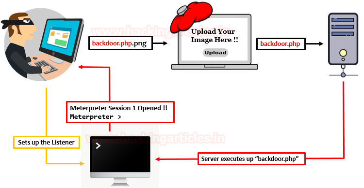

# File Upload Vulnerabilities

## Introduction

File upload vulnerabilities pose significant risks to web applications, allowing attackers to upload and execute malicious files on the server. Despite efforts to secure file upload functionality, vulnerabilities may still exist, potentially leading to unauthorized access, data breaches, or even remote code execution.

## Table of Contents

- [How to Identify](#how-to-identify)
- [Code/Tools/Websites](#code-tools-websites)
  - [Tools](#tools)
  - [Websites](#websites)
- [Prevention Techniques](#prevention-techniques)
- [References](#references)
- [Conclusion](#conclusion)

## How to Identify

File upload vulnerabilities can be identified through various means:

- **Testing File Restrictions**: Check if the application enforces restrictions on file types, sizes, and content.
- **Manipulating Requests**: Use intercepting proxies like Burp Suite to manipulate file upload requests and bypass security measures.
- **Analyzing Responses**: Examine server responses to uploaded files for any indications of successful uploads or vulnerabilities.
- **Exploring Error Messages**: Look for error messages that may reveal weaknesses in the file upload functionality.

## Code/Tools/Websites

### Tools

- **Burp Suite**: A versatile web vulnerability scanner and testing tool.
- **OWASP ZAP**: An open-source web application security scanner.
- **Nmap**: A network scanning tool that can help identify potential vulnerabilities.

### Websites

- [PortSwigger Web Security Academy - File Upload](https://portswigger.net/web-security/file-upload)
- [Hack The Box CTF Platform](https://ctf.hackthebox.com/)

## Prevention Techniques

To mitigate file upload vulnerabilities, consider implementing the following preventive measures:

- **Validate File Types**: Enforce strict validation of file types and content before allowing uploads.
- **Restrict File Permissions**: Limit file permissions to prevent uploaded files from being executed.
- **Implement Security Headers**: Set appropriate Content-Disposition headers to prevent browsers from interpreting uploaded files as inline content.
- **Regular Security Audits**: Conduct regular security audits to identify and patch vulnerabilities in file upload functionality.
- **Educate Users**: Educate users about the risks associated with file uploads and encourage safe upload practices.

## References

- [OWASP File Upload Security Best Practices](https://owasp.org/www-community/vulnerabilities/Unrestricted_File_Upload)
- [PortSwigger Web Security Academy](https://portswigger.net/web-security/file-upload)

## Conclusion

File upload vulnerabilities can have severe consequences for web applications, leading to data breaches, unauthorized access, and remote code execution. By understanding these vulnerabilities and implementing appropriate preventive measures, developers can enhance the security of their applications and protect against potential exploits.
-  Content: Vijay

