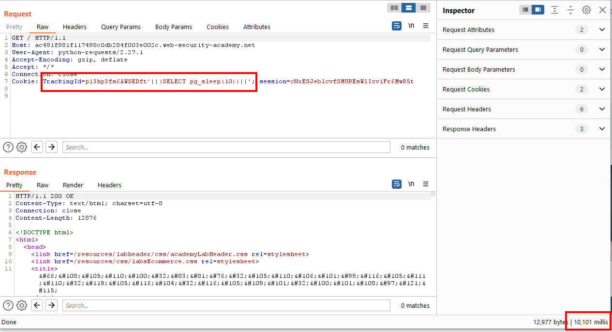

# SQL Injection: Time-Based Blind SQL Injection

## Introduction

Time-Based Blind SQL Injection is a type of SQL injection attack where the attacker uses SQL commands that cause the database to delay its response. By measuring the time it takes for the server to respond, the attacker can infer information about the database.

## Table of Contents

- [SQL Injection: Time-Based Blind SQL Injection](#sql-injection-time-based-blind-sql-injection)
  - [Introduction](#introduction)
  - [Table of Contents](#table-of-contents)
  - [How to identify](#how-to-identify)
  - [Code/tools/websites](#codetoolswebsites)
    - [Tools](#tools)
    - [Websites](#websites)
  - [Sample problem](#sample-problem)
    - [Problem Statement](#problem-statement)
    - [Solution](#solution)
  - [References](#references)
  - [Conclusion](#conclusion)

## How to identify

To identify Time-Based Blind SQL Injection vulnerabilities, look for inputs that cause delays in server responses. Indicators include:

1. **Behavior Testing:** Entering SQL syntax that includes delay functions (e.g., `SLEEP`) to see if the application response time changes.
2. **Consistent Delays:** Testing with various delay times to confirm the behavior. Example:
```SQL
http://example.com/item.php?id=1 AND IF(1=1, SLEEP(5), 0) -- (5-second delay)
http://example.com/item.php?id=1 AND IF(1=2, SLEEP(5), 0) -- (No delay)
```
3. **Code analysis:** When the source code is provided look for php code that doesn't sanitize the input.
Here is an example of a vulnerable PHP code snippet:
```php
<?php
$id = $_GET['id'];
$query = "SELECT * FROM items WHERE id = '$id'";
$result = mysqli_query($conn, $query);
?>
```
## Code/tools/websites

### Tools
- **SQLMap:** An automated tool for SQL injection and database takeover.
- **Burp Suite:** A web vulnerability scanner with tools for manual testing.
- **Havij:** An automated SQL injection tool.

### Websites
> https://www.hackthebox.com/: Great place to learn and practice problems
>
> https://picoctf.com/: They have many labs and past question which you can try with great write-ups available online.

## Sample problem

### Problem Statement
You are given access to a web application which uses a tracking [cookie](https://dev.to/arikaturika/web-cookies-beginners-guide-28lh) for analytics, and performs a SQL query containing the value of the submitted cookie.

The queries are executed synchronously, so it is possible to trigger conditional time delays to infer information.

Identify if the application is vulnerable to Time-Based Blind SQL Injection and cause a 10 second delay.

[Link to the lab](https://portswigger.net/web-security/sql-injection/blind/lab-time-delays)

<details>

<summary>HINT</summary>

The query will look something like this:

```sql
SELECT trackingId FROM someTable WHERE trackingId = '<COOKIE-VALUE>'
```
</details>

### Solution
<details>
<summary>Click to reveal the solution</summary>

#### Confirm vulnerable parameter

Due to the type of vulnerability, we can not distinguish whether the injection caused any reaction just by seeing the webpage. This also makes finding an injection point more difficult, as simply injecting a single quote does not cause any reaction.

A thing to remember that the command for time delay varies between different types of databases. 

On the [sheet](https://portswigger.net/web-security/sql-injection/cheat-sheet) provided in the [introduction section](README.md), time-delay examples are given for multiple database engines. As we don't know which one to choose, we need to attempt them one by one.

```SQL
Oracle: dbms_pipe.receive_message(('a'),10)
Microsoft: WAITFOR DELAY '0:0:10'
PostgreSQL: SELECT pg_sleep(10)
MySQL: SELECT sleep(10) 
```

The important thing is that the query must remain valid, because if there are errors, we will not get any indication of it and may assume that the injection failed and move to the next database engine, when in fact the query was never executed.

Now form the following query (ABC being the value of the tracking cookie).

```sql
SELECT trackingId FROM someTable WHERE trackingId = 'ABC' || (<Time dealy code HERE>) || ''
```

The first character injected is the single quote after the ABC, then concatenate the output of the code, followed by another concatenation with a single quote. For Oracle and PostgreSQL, the `||`s are used for concatenation, for Microsoft a `+` and for MySQL a single space.

You can Burp Repeater to try the different payloads. Reaching the PostgreSQL syntax, the query takes a long time to finish: 10.101s.



Reloading the page will show that the lab is solved.

</details>

## References

- [OWASP SQL Injection](https://owasp.org/www-community/attacks/SQL_Injection)
- [PortSwigger Web Security Academy](https://portswigger.net/web-security/sql-injection/blind#exploiting-blind-sql-injection-by-triggering-time-delays)
- [SQLMap Documentation](https://sqlmap.org/)

## Conclusion

Time-Based Blind SQL Injection exploits delays in server response times to infer information about the database. Identifying these vulnerabilities requires careful timing analysis and checking things one by one. 